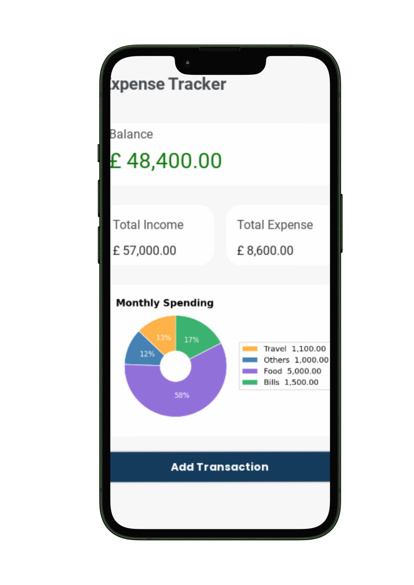
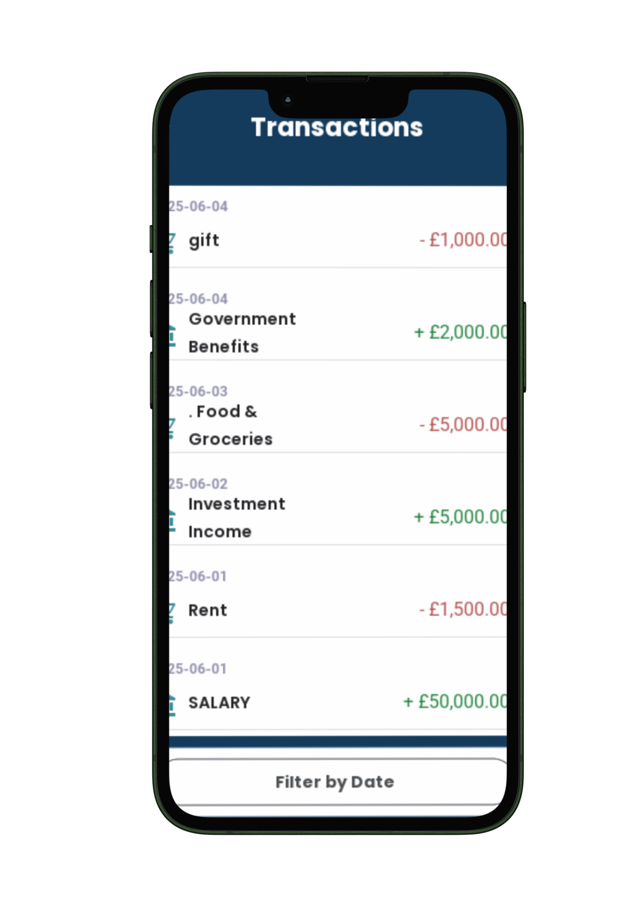

# 📱 Nexpenz – Free Expense Tracker App

**Version 1.0.0**  
Your simple, fast, and free personal finance tracker for Android



---

## 🚀 Features

- ✅ Add **income & expenses** instantly
- 📈 View **monthly charts** by category
- 🧾 Track full **transaction history**
- 🌍 Choose your preferred **currency**
- 🔐 No signup/login — just **generate an API key**
- 🧡 100% free. No ads. No tracking.

---

## 📦 Download APK

> [⬇️ Download Nexpenz v1.0.0](https://nexpenz.nexapytechnologies.com/download)  
> *(Direct APK – Android only)*

---

## 🖼 Screenshots

| Dashboard| Add Transactions | transactions |
|------|-------------|----------------|
|  |  |  |

---

## 🔧 Backend

This app is powered by a Django backend that allows users to:

- Generate API keys
- Store their transaction data securely
- Serve APK for direct download

---

## 🛠 Local Setup (Dev)

### Prerequisites
- Python 3.10+
- Django 4+
- Git

```bash
git clone https://github.com/nexapytech/nexpenz.git

